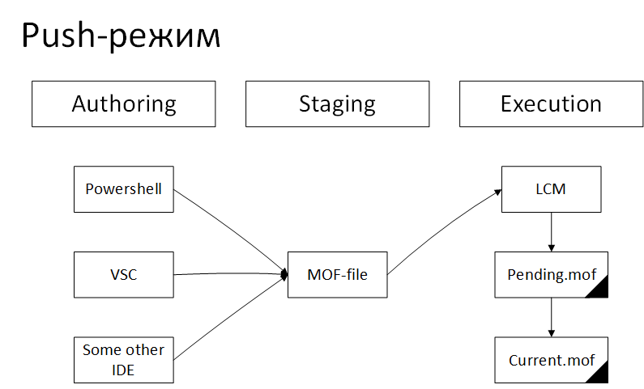

Push и Pull в Desired State Configuration
=========================================

Мы уже рассказали, как описывать конфигурацию в Desired State Configuration (DSC) и разобрали встроенный 
агент Local Configuration Manager (LCM) для применения конфигурации на сервере. В первой части статьи 
пошагово прошлись по основным особенностям инструмента вместе с Евгением Парфеновым из DataLine.

Здесь же погрузимся в настройку и особенности работы в режимах Push и Pull.

Различия режимов Push и Pull
----------------------------

В режиме Push мы вручную или скриптом запускаем процесс применения изменений на сервере 
(локально или удаленно). Local Configuration Manager (LCM) применяет конфигурацию интерактивно.

В режиме Pull сам агент LCM на сервере по расписанию сравнивает свою конфигурацию с конфигурацией, 
опубликованной в общем хранилище конфигураций. Если имеются изменения, то конфигурация копируется локально и применяется.

Плюсы и минусы обоих режимов работы вполне очевидны.

**Push**

Плюсы:

#. Стоимость. Не требует установки дополнительных серверов.
#. Простая архитектура. Все конфигурации хранятся локально в том виде, в котором удобно администратору. 
#. Подходит для тестирования DSC
#. DevOps Way. При развёртывании серверов очень просто автоматизируется и вписывается в философию Infrastructure as a Code.
#. Отличная замена run-once скриптов при развёртывании виртуальных машин.

Минусы:

#. В On-Premise инфраструктурах возможны cложности в управлении серверами. Требует доступного подключения к серверу в момент применения конфигурации, что не всегда возможно.

**Pull**

Плюсы:

#. Автоматизация применения конфигураций. Конфигурации применяются автоматически самими управляемыми серверами.
#. Простота управления большим количеством серверов. Большая часть работы выполняется агентами DSC на самих серверах.
#. Этот же режим используется в Azure Automation State Configuration, что очень удобно при конфигурации виртуальных машин Windows Server 2012R2+

Минусы:

#. Требует установки дополнительного сервера, который будет хранить все конфигурации управляемых серверов.
#. В On-Premise инфраструктурах настройки сервера с конфигурациями распространяются через GPO, что автоматически делает данный метод негарантированной доставкой конфигурации целевому серверу.
#. Как следствие — сложность мониторинга применения конфигурации, особенно если конфигураций несколько и они должны применяться в определенном порядке.

Установка ресурсов также немного отличается для разных режимов. Как мы помним, для использования 
ресурса нужно установить его локально и на сервер.

В случае использования режима Push администратор должен предварительно установить все необходимые 
ресурсы на управляемый сервер и на ПК, откуда конфигурация будет подана.

В режиме Pull — агент DSC на управляемом сервере может самостоятельно установить все необходимые ресурсы 
с Pull-сервера, задача администратора – разместить их на Pull-сервере. Однако держим в уме, что невозможно 
спрогнозировать применение конфигурации в режиме Pull, так как GPO не является гарантированной доставкой 
настроек.

Push-режим в деталях
--------------------

Верхнеуровнево процесс написания и применения конфигураций DSC можно представить в следующем виде:

    