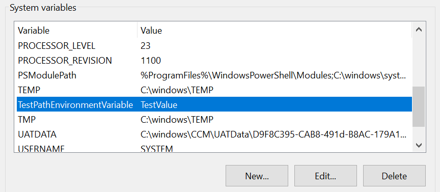
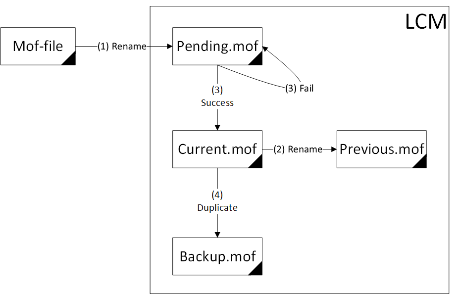
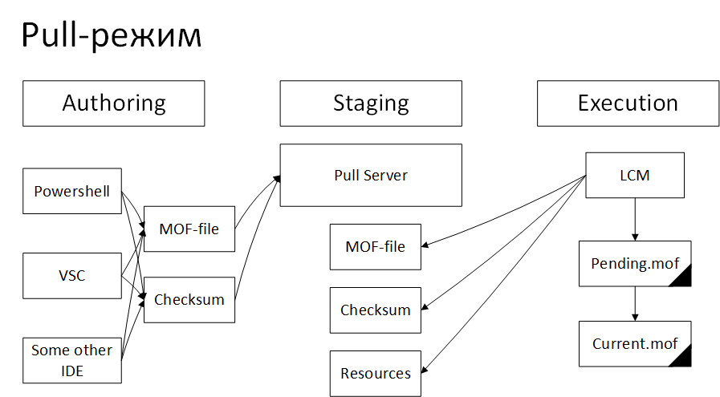

Push и Pull в Desired State Configuration
=========================================

Мы уже рассказали, как описывать конфигурацию в Desired State Configuration (DSC) и разобрали встроенный 
агент Local Configuration Manager (LCM) для применения конфигурации на сервере. В первой части статьи 
пошагово прошлись по основным особенностям инструмента вместе с Евгением Парфеновым из DataLine.

Здесь же погрузимся в настройку и особенности работы в режимах Push и Pull.

Различия режимов Push и Pull
----------------------------

В режиме Push мы вручную или скриптом запускаем процесс применения изменений на сервере 
(локально или удаленно). Local Configuration Manager (LCM) применяет конфигурацию интерактивно.

В режиме Pull сам агент LCM на сервере по расписанию сравнивает свою конфигурацию с конфигурацией, 
опубликованной в общем хранилище конфигураций. Если имеются изменения, то конфигурация копируется локально и применяется.

Плюсы и минусы обоих режимов работы вполне очевидны.

**Push**

Плюсы:

#. Стоимость. Не требует установки дополнительных серверов.
#. Простая архитектура. Все конфигурации хранятся локально в том виде, в котором удобно администратору. 
#. Подходит для тестирования DSC
#. DevOps Way. При развёртывании серверов очень просто автоматизируется и вписывается в философию Infrastructure as a Code.
#. Отличная замена run-once скриптов при развёртывании виртуальных машин.

Минусы:

#. В On-Premise инфраструктурах возможны cложности в управлении серверами. Требует доступного подключения к серверу в момент применения конфигурации, что не всегда возможно.

**Pull**

Плюсы:

#. Автоматизация применения конфигураций. Конфигурации применяются автоматически самими управляемыми серверами.
#. Простота управления большим количеством серверов. Большая часть работы выполняется агентами DSC на самих серверах.
#. Этот же режим используется в Azure Automation State Configuration, что очень удобно при конфигурации виртуальных машин Windows Server 2012R2+

Минусы:

#. Требует установки дополнительного сервера, который будет хранить все конфигурации управляемых серверов.
#. В On-Premise инфраструктурах настройки сервера с конфигурациями распространяются через GPO, что автоматически делает данный метод негарантированной доставкой конфигурации целевому серверу.
#. Как следствие — сложность мониторинга применения конфигурации, особенно если конфигураций несколько и они должны применяться в определенном порядке.

Установка ресурсов также немного отличается для разных режимов. Как мы помним, для использования 
ресурса нужно установить его локально и на сервер.

В случае использования режима Push администратор должен предварительно установить все необходимые 
ресурсы на управляемый сервер и на ПК, откуда конфигурация будет подана.

В режиме Pull — агент DSC на управляемом сервере может самостоятельно установить все необходимые ресурсы 
с Pull-сервера, задача администратора – разместить их на Pull-сервере. Однако держим в уме, что невозможно 
спрогнозировать применение конфигурации в режиме Pull, так как GPO не является гарантированной доставкой 
настроек.

Push-режим в деталях
--------------------

Верхнеуровнево процесс написания и применения конфигураций DSC можно представить в следующем виде:

.. image:: ../../_static/xb4vtdh2aro8hh5-en6fqymutkm.png
    :align: left

На первой стадии (Authoring) мы описываем конфигурацию используя любой удобный нам IDE (Notepad, PowerShell ISE, Visual Studio Code и другие). По завершении мы компилируем mof-файлы конфигурации (процесс компилляции описан в нашей предыдущей статье).

На второй стадии (Staging/Compilation) мы запускаем применение конфигурации из скомпилированного mof-файла с помощью командлета Start-DSCConfiguration. В процессе сервер управления передаёт mof-файл LCM сервера, который должен применить конфигурацию.
В данном случае лучше использовать ключ -Verbose для полного контроля процесса конфигурации:

.. code-block:: powershell

    PS C:\windows\system32> Start-DscConfiguration -Path C:\EnvironmentVariable_Path\ -Wait -Verbose

    # Cтарт конфигурации
    VERBOSE: Perform operation 'Invoke CimMethod' with following parameters, ''methodName' =
    SendConfigurationApply,'className' = MSFT_DSCLocalConfigurationManager,'namespaceName' =
    root/Microsoft/Windows/DesiredStateConfiguration'.
    VERBOSE: An LCM method call arrived from computer COMPUTER with user sid
    S-1-5-21-SID.

    # Подгрузка ресурсов
    VERBOSE: [COMPUTER]: LCM:  [ Start  Set      ]
    VERBOSE: [COMPUTER]: LCM:  [ Start  Resource ]  [[Environment]CreatePathEnvironmentVariable]

    # Старт проверки на соответствие заданным условиям (test)
    VERBOSE: [COMPUTER]: LCM:  [ Start  Test     ]  [[Environment]CreatePathEnvironmentVariable]
    VERBOSE: [COMPUTER]:                            [[Environment]CreatePathEnvironmentVariable] Environment variable
    'TestPathEnvironmentVariable' does not exist.
    VERBOSE: [COMPUTER]: LCM:  [ End    Test     ]  [[Environment]CreatePathEnvironmentVariable]  in 0.1320 seconds.
    # Проверка завершилась неудачно с сообщением “Environment variable 'TestPathEnvironmentVariable' does not exist”

    # Начинаем исправлять ситуацию и создаем переменную среды
    VERBOSE: [COMPUTER]: LCM:  [ Start  Set      ]  [[Environment]CreatePathEnvironmentVariable]
    VERBOSE: [COMPUTER]:                            [[Environment]CreatePathEnvironmentVariable] Environment variable
    'TestPathEnvironmentVariable' created with value 'TestValue'.
    VERBOSE: [COMPUTER]: LCM:  [ End    Set      ]  [[Environment]CreatePathEnvironmentVariable]  in 0.0690 seconds.
    VERBOSE: [COMPUTER]: LCM:  [ End    Resource ]  [[Environment]CreatePathEnvironmentVariable]
    VERBOSE: [COMPUTER]: LCM:  [ End    Set      ]
    VERBOSE: [COMPUTER]: LCM:  [ End    Set      ]    in  2.1900 seconds.
    # Переменная создана

    # Закрытие сессии
    VERBOSE: Operation 'Invoke CimMethod' complete.
    VERBOSE: Time taken for configuration job to complete is 2.749 seconds

Видно, что движок проверил наличие переменной, не нашёл её и создал новую, согласно указанной конфигурации:

На третьей стадии (Execution) в игру вступает агент DSC – LCM. Он получает mof-файл, проверяет его, размещает в папку ``$env:systemRoot/system32/configuration`` и запускает воркфлоу применения файла конфигурации:

#. LCM получает, применяет файл конфигурации. Файл переименовывается в pending.mof и размещается в ``$env:systemRoot/system32/configuration``
    * Если применение файла конфигурации завершается с ошибкой, то файл pending.mof остаётся, и LCM попробует его применить при следующем цикле.
#. Если в папке уже есть файл current.mof, то он переименовывается в previous.mof
#. Если применение файла конфигурации завершается успешно, то LCM переименовывает его в current.mof
#. Файл current.mof копируется в файл backup.mof

Графически воркфлоу можно изобразить следующим образом:

Для управления разными файлами конфигурации имеется командлет Remove-DSCConfigurationDocument, который позволяет удалять конкретные документы, если это по какой-то причине необходимо сделать. Впрочем, ничто не мешает нам их удалить вручную.

Pull-режим в деталях
--------------------

Pull-режим сложнее в развёртывании и настройке, но он сильно упрощает процесс управления серверами, которые подключены к нему.

Общая схема будет выглядеть примерно так:

Pull-режим требует развёртывания Pull-сервера. Фактически он является обычным веб-сервером, который может отдавать клиентам mof-файлы и ресурсы, которые могут потребоваться при применении конфигураций из mof-файлов. Последнее сильно упрощает процесс управления и конфигурации серверов, так как задача по доставке необходимых ресурсов ложится на клиента. Pull-сервер при этом выступает в качестве хранилища\репозитория ресурсов.

Pull-сервер умеет предоставлять доступ к ресурсам и файлам конфигурации через два протокола:

#. **SMB**. Файлы складываются на обычной файловой шаре на сервере. При необходимости можно прикрутить DFS-R. Легко разворачивается, но сложно настраивать в распределённых системах, так как требуется открывать динамический диапазон портов для доступа клиентов. Также SMB не годится в мультидоменной инфраструктуре, так как серверы из других доменов или серверы не в домене не смогут пройти аутентификацию через Kerberos.
#. **Http/https**. Лучший вариант для управления серверами из разных сетей и доменов. Требует установки IIS.

Установка Pull сервера может быть выполнена через штатные ресурсы, которые предлагает команда разработки DSC. Подробнее можно посмотреть тут. Или использовать решения, предлагаемые сообществом: тут или здесь.

Воркфлоу дальнейшей работы с pull-сервером следующий:

#. Настраиваем клиентов (LCM) на работу с pull-сервером.
#. Загружаем на pull-сервер файлы ресурсов.
#. Готовим клиентские файлы конфигурации (написание и компиляция) и файлы с проверочными суммами.
#. Наслаждаемся результатом.

Настройка клиентов (LCM) на работу с pull-сервером
~~~~~~~~~~~~~~~~~~~~~~~~~~~~~~~~~~~~~~~~~~~~~~~~~~~~

Для этого используются следующие настройки LocalConfigurationManager (v5):

Блок **Settings**:

* **CertificateID** – указывается отпечаток сертификата для защиты логинов\паролей передаваемых в конфигурации.
* **ConfigurationID** – содержит GUID клиента. На клиента будут применяться только те конфигурации, которые содержат его GUID в имени файла конфигурации. Настройка оставлена для совместимости со старыми версиями pull-сервера. Лучше использовать настройку RegistrationKey.
* **RefreshMode** – для работы с Pull-серверов указываем Pull в этой настройке.

Блок **ConfigurationRepositoryWeb**:

* **AllowUnsecureConnection** – разрешать\не разрешать подключение без аутентификации.
* **CertificateID** – указывается отпечаток сертификата на клиенте, который будет использоваться в процессе взаимной аутентификации с сервером.
* **ConfigurationNames** – массив имён конфигураций, которые будут применяться на клиента.
* **RegistrationKey** – сгенерированный на сервере секрет, который используется клиентом для регистрации на сервере.
* **ServerURL** – URL Pull-сервера с конфигурациями.

Блок **ResourceRepositoryWeb**:

* **AllowUnsecureConnection** – разрешать\не разрешать подключение без аутентификации.
* **CertificateID** – указывается отпечаток сертификата на клиенте, который будет использоваться в процессе взаимной аутентификации с сервером.
* **RegistrationKey** – сгенерированный на сервере секрет, который используется клиентом для регистрации на сервере.
* **ServerURL** – URL Pull-сервера с ресурсами.

Блок **ReportServerWeb**:

* **AllowUnsecureConnection** – разрешать\не разрешать подключение без аутентификации.
* **CertificateID** – указывается отпечаток сертификата на клиенте, который будет использоваться в процессе взаимной аутентификации с сервером.
* **RegistrationKey** – сгенерированный на сервере секрет, который используется клиентом для регистрации на сервере.
* **ServerURL** – URL Pull-сервера с отчётами.

Загрузка на Pull-сервер файлов ресурсов
~~~~~~~~~~~~~~~~~~~~~~~~~~~~~~~~~~~~~~~
После применения новых настроек на LCM, которые научат его использовать Pull-сервер, можно загружать на сервер файлы ресурсов. Ресурсы загружаются на сервер в виде zip-файлов (папка с ресурсом упаковывается в zip). Правило именования такого файла:

.. code-block:: powershell

    {ModuleName}_{Version}.zip

Место размещения файла по умолчанию ``$env:PROGRAMFILES\WindowsPowerShell\DscService\Modules``. При установке Pull-сервера эту папку можно переопределить. Кроме файла с упакованной в zip папкой ресурса необходимо там же разместить файл с контрольной суммой этого упакованного ресурса. Например, так:

.. code-block:: powershell

    New-DscChecksum -Path .\xPSDesiredStateConfiguration_8.4.4.0.zip

Размещение на Pull-сервере файлов конфигураций клиентов
~~~~~~~~~~~~~~~~~~~~~~~~~~~~~~~~~~~~~~~~~~~~~~~~~~~~~~~

Здесь важно отметить, что мы можем использовать два режима работы клиентов в данном случае (на самом деле два с половиной): клиент с сервера будет получать конфигурацию, используя **ConfigurationID**, или клиент будет использовать имя конфигурации – **ConfigurationName**. Если необходимо применить несколько конфигураций, то все их можно указать в ConfigurationName, но при этом придётся LCM настроить на работу с частичными конфигурациями (partial configuration).

При использовании ConfigurationID нужно подчеркнуть, что mof-файл конфигурации, который будет применён на клиента, будет содержать GUID (он содержится в ConfigurationID). В случае использования ConfigurationName – mof-файл будет содержать имя конфигурации, которое мы укажем в ConfigurationName. В обоих случаях помимо mof-файла там же будет размещаться файл контрольной суммы конфигурации:

.. code-block:: powershell

    New-DscChecksum -Path '.\' -Force

В качестве заключения
---------------------

Мы посмотрели два способа применения изменений на сервере в режимах Push и Pull. Прошлись по особенностям использования и постарались объяснить все нюансы, которые могут возникнуть при работе с этими режимами в DSC. Если у вас остались вопросы – давайте обсуждать в комментариях. А если не хватило наглядности – приходите к нам на онлайн-митап 28 мая: разберем системы объединенных коммуникаций и средства связи (настройка выгрузки логов Exchange в Elastic, Microsoft Endpoint Manager в управлении iOS, Android и Windows 10) и более подробно поговорим про границы применимости PowerShell Desired State Configuration. Нужно только зарегистрироваться.